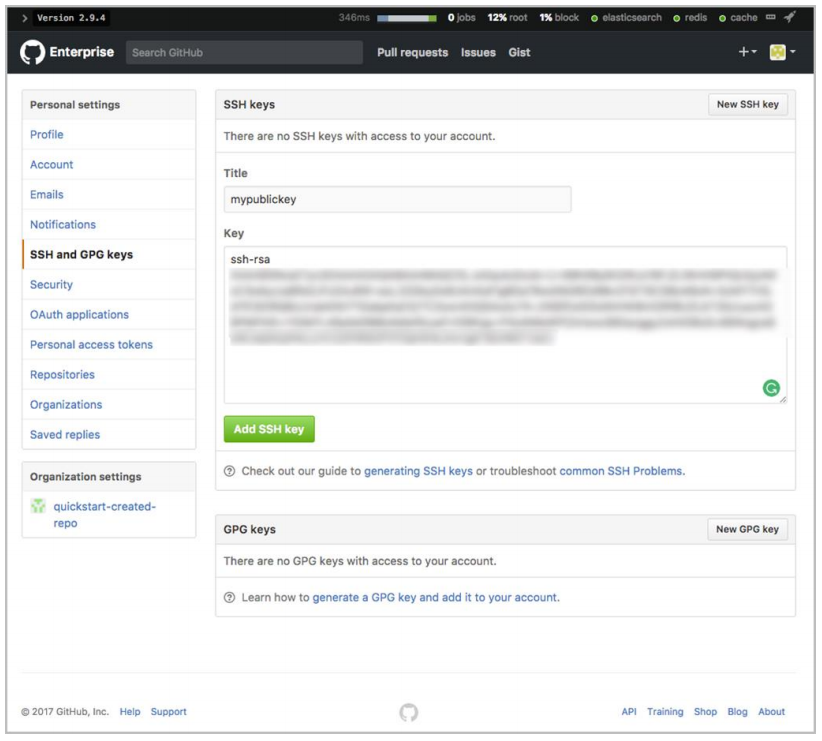

// Add steps as necessary for accessing the software, post-configuration, and testing. Don’t include full usage instructions for your software, but add links to your product documentation for that information.
//Should any sections not be applicable, remove them

== Test the deployment

The Quick Start sets up a sample organization and repository during the deployment
process. You can test the deployment by accessing the GitHub Enterprise EC2 instance,
accessing the sample repository, and cloning it.

1. Use the URL of the primary instance displayed in the Outputs tab for the stack to view the resources that were created.
2. Log in to GitHub Enterprise. Enter the site administrator user name and password you provided in the Quick Start parameters.

[#additional1]
.GitHub Enterprise login
image::../images/image1.png[Architecture,width=50%,height=50%]

[start=3]
3. Upload a deploy key. This is an SSH key that gives you access to the sample GitHubrepository.

* Navigate to http://<githuburl>/setting/keys.
* In the sidebar, choose *SSH and GPG keys*.
* Choose *New SSH key*.
** For *Title*, give your key a descriptive name.
** In the *Key* field, paste your public key. This key is typically found in~/.ssh/id_rsa.pub.
** Choose *Add SSH key*

[#additional2]
.Adding an SSH key

[start=4]
4. Clone your GitHub repository.

* Navigate back to the main page by choosing the GitHub Enterprise logoon the navigation bar.
* Switch dashboard context by selecting the organization name. This is the organization you specified in the Quick Start parameters.

[#additional3]
.Finding the GitHub repository created by the Quick Start 
image::../images/image3.png[Architecture,width=75%,height=75%]

[start=5]
5. Select the repository name. This is the repository you specified in the Quick Start parameters in step 3 (*repo1* in the following figure).

[#additional4]
.Choosing the sample repository 
image::../images/image4.png[Architecture,width=75%,height=75%]

[start=6]
6. Choose *Clone or download*, and then copy the Git URL that’s displayed by choosing the Clipboard icon

[#additional5]
.Cloning the repository
image::../images/image5.png[Architecture,width=75%,height=75%]

[start=7]
7. Open a terminal shell. (This requires that you install https://git-scm.com/[Git] on your workstation, as instructed in the Prerequisites section.)
8. Use the Git CLI to clone your repository:

----
git clone git@13.58.62.155:quickstart-created-repo/repo1.git
----

[#additional6]
.Successfully cloned repository
image::../images/image6.png[Architecture,width=75%,height=75%]

To try out additional GitHub Enterprise features, follow the instructions in the https://help.github.com/enterprise/2.9/[GitHub Enterprise documentation].
