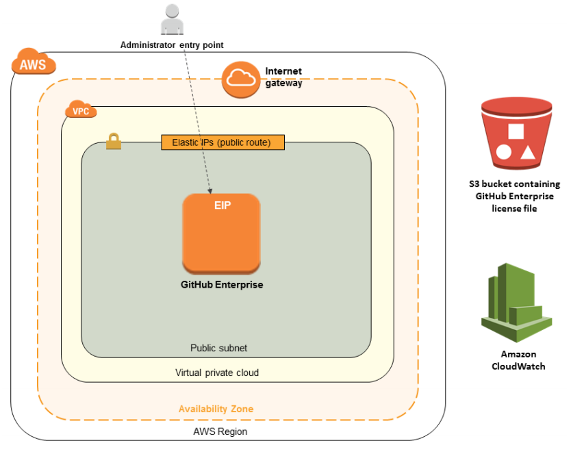

Deploying this Quick Start for a new virtual private cloud (VPC) with
default parameters builds the following {partner-product-short-name} environment in the
AWS Cloud.

// Replace this example diagram with your own. Send us your source PowerPoint file. Be sure to follow our guidelines here : http://(we should include these points on our contributors giude)
:xrefstyle: short
[#architecture1]
.Quick Start architecture for {partner-product-short-name} on AWS

As shown in <<architecture1>>, the Quick Start sets up the following:

* A virtual private cloud (VPC) with a single Availability Zone and one public subnet.*
* An Internet gateway to allow access to the Internet.*
* In the public subnet, a GitHub Enterprise EC2 instance with an attached, customizable
EBS volume.
* An Amazon CloudWatch monitoring resource that will automatically restore the GitHub
Enterprise EC2 instance if it becomes unresponsive.
* An IAM role with the necessary permissions to manage access to resources.
* A security group to enable communication within the VPC and to interact with the
GitHub Enterprise EC2 instance.
* A sample Github organization and repository you can use to test the deployment.

[.small]#*The template that deploys the Quick Start into an existing VPC skips the components marked by asterisks and prompts you for your existing VPC configuration.#
